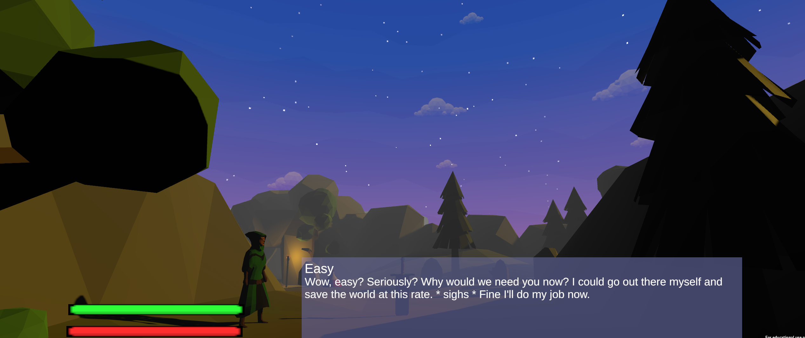

## Thomas Burke Profolio

Hello, I am Thomas Burke I am a recent grad of Atu/ Gmit. Where I have recently completed my honours degree in Digital media & Computing with second-class honors. For this, I also completed a level 7 degree in Digital media & Computing with a distinction. I currently volunteer at dapper fox group as a software engineer. I am currently working on a personal project for a game called kingdoms. I enjoy programming I am most skilled in java and have no issue picking up new skills
#[Github](https://github.com/killbot24)
## Languages
- Java
- JavaScript
- Php
- TypeScript
- React
- Css
- Html
- C# (In unity only)
- Some C++

## College / Uni Projects
### React Web app

This app was built for a project. It uses restful api to build a store. 

[React App](https://github.com/killbot24/DataRep-Project)

### MetaEvil

[Itch.io](https://chickon98.itch.io/metaevil)

Role: Lead programmer.
I oversaw programming I built out all mechanics bar the character animation code and the original base of the inventory. I modified the inventory to meet our needs along with building the ai, Combat, Dialog, Shop, Health and stamina 

Project desc,
This was a group project for Atu/ Gmit. I and 2 others built a game called MetaEvil the premises of the game. The game would comment on the player’s progress, Choices, and failures. 

With this project we got into stage 2 of the enterprise ireland student awards

        
            

### Breakit

Is a vr for oculus quest 2 game built in unity the goal of the game is to break objects earning you points with out being caught by the guard. The vases will break with a animation upon contact with your bat. Paintings will change.

[game.apk](https://drive.google.com/file/d/1gAcST2EA8I1HYDUs_WcxBCfe6ZN9s6yW/view?usp=sharing)

### Game (un named)
This was a project i built out for a class called 3dworlds. I aimed to build a simple game but add some extra features in. Such extra features are extra endings deppending on the players choice. 

## Personal projects

## MetaEvil (Unreal engine rebuild)
Currently i am working on rebuilding metaEvil in unreal engine. This is in the very early stages atm 

### **Chatfilter**

Chatfilter I built for [https://dapperfoxstudios.com/](url) for their kinetic network. I built this when I was an admin for their servers It wasn’t requested I just got tired of people ruining the player experience for others when there was no staff online. This runs on the API spigot & sponge

[Source Sponge](https://github.com/killbot24/chatfilter-Sponge)
[Source Paper](https://github.com/killbot24/chatfilter-spigot)
Linkedin [https://www.linkedin.com/in/thomas-burke-277a1b224/](url)

